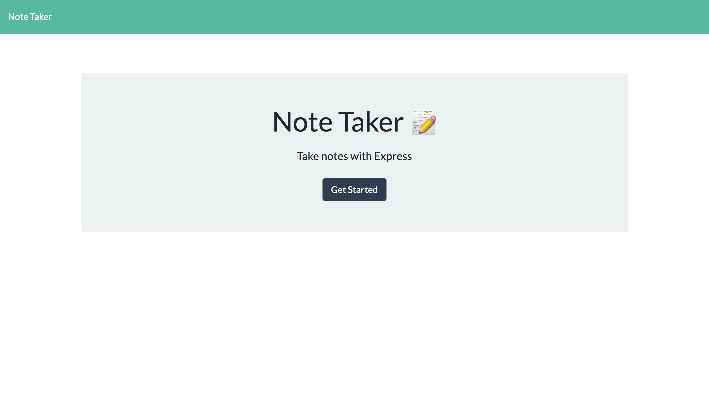
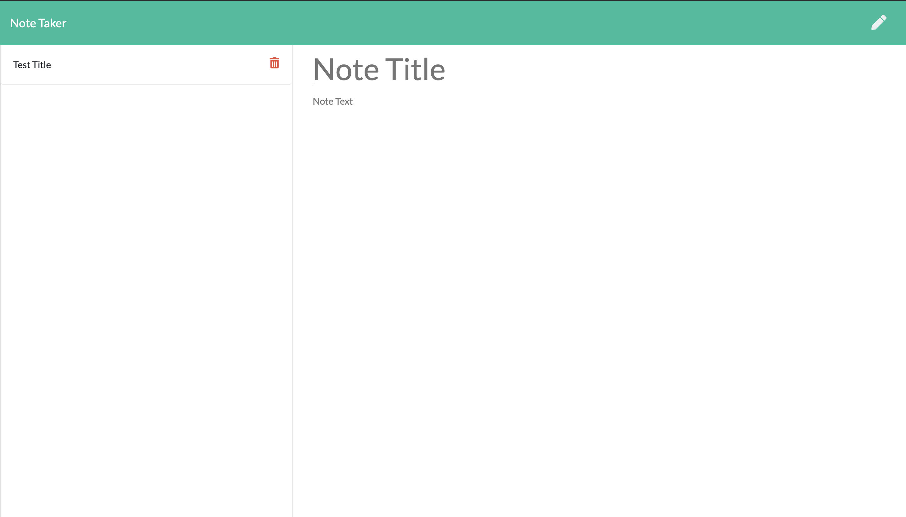

# Note-Taker
MIT

## Description
An application that can be used to write, save, and delete notes. This application uses an express backend to save and retrieve data from a JSON file.

## Table of Contents

* [Installation](#installation)
* [Usage](#usage)
* [License](#license)
* [Technologies](#technologies)
* [Contributing](#contributing)
* [Tests](#tests)
* [Questions](#questions)

## Installation
Must have Node.js installed. Must install npm modules and packages associated with the app..

## Usage
There are some problems with the API so the app might not work correctly at this time.

## Technologies
* HTML
* CSS
* JavaScript
* Express

## Contributing
This project is open to contributors and suggestions.

## Tests
Testing framework used: None.

## Deployed Version
Link to the deployed app: https://polar-falls-96628.herokuapp.com/.

## Questions
GitHub Profile: https://github.com/amyventura. 
If you have any further questions, you can contact me through email at amyvntr@gmail.com.

